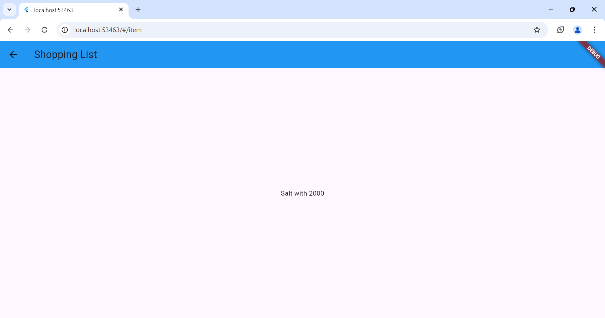
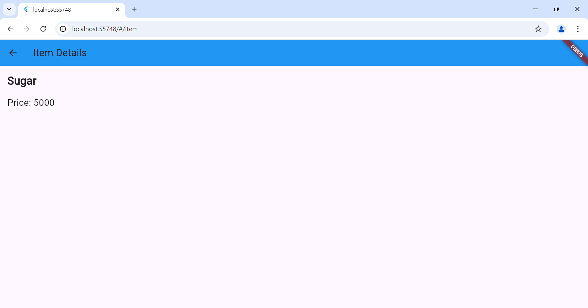
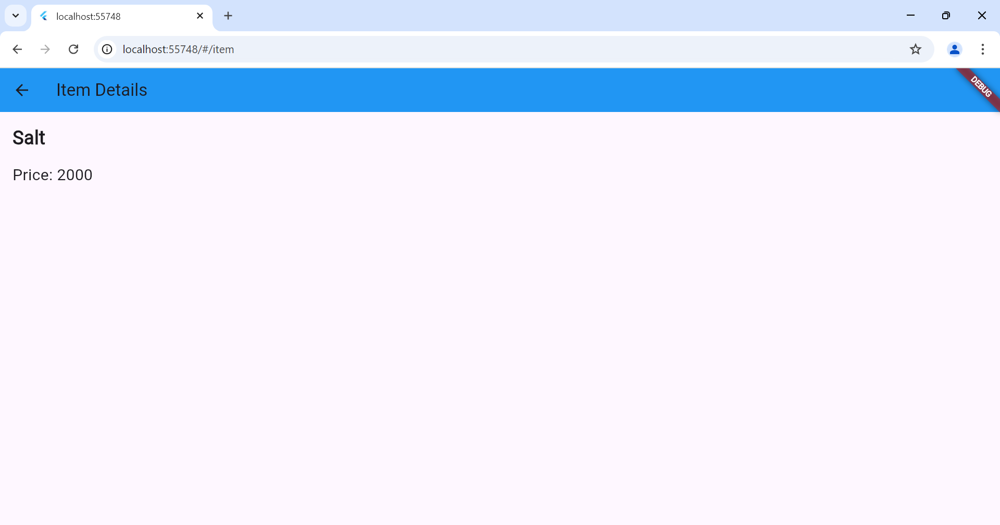

# navigasi

A new Flutter project.

## Getting Started

Praktikum 5: Membangun navigasi di flutter

langkah 1: Buat new project dengan nama belanja dan buat folder models, pages, widgets dalam lib

Langkah 2: Definisikan route 
buat file home_page.dart dan item_page.dart dalam folder pages, kemudian deklarasikan dan turunkan class dari StatelessWidget.

Langkah 3: Lengkapi main.dart
Halaman homepage didefinisikan sebagai / dan itempage sebagai /item.

Langkah 4: Buatlah data model
Buatlah file item.dart dalam folder models.

Langkah 5: Melengkapi kode dalam class homepage 
Data ListView dari model list dari objek item.

Langkah 6: Membuat listview dan itembuilder

Langkah 7: Tambahkan aksi pada listview
Menggunakan widget InkWell untuk memberikan efek ketika diklik

Tugas Praktikum 2:
1.Tambahkan arguments pada navigator untuk melakukan pengiriman data ke halaman berikutnya.

2.Gunakan ModalRoute untuk pembacaan nilai yang dikirim pada halaman sebelumnya.

